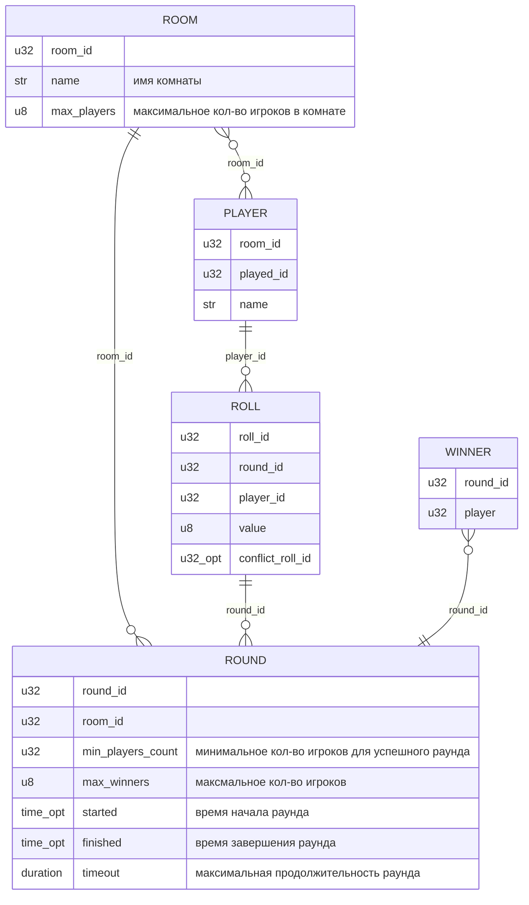
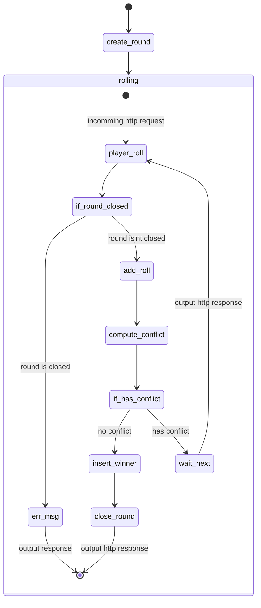

roll1dn
===================

Модель
============================



- **ROOM** Игравая комната
- **PLAYER** Игрок
- **ROUND** Раунд
- **ROLL** Бросок кубика
- **WINNER** Победитель

Сценарии
============================

- Регистрация игрока
- Регистрация комнаты
- Старт роунда
- Бросок кубика

Бросок кубика
-----------------------------



API
=====================

- users
  - POST `/user/{name}` create user
    - res
      ```json
      {
        "name": "user name"
        "id": 123
      }
      ```
  - GET `/user` list users
    - res
      ```json
      [ { "name": "username a", id:123 } ,
        { "name": "username b", id:124 } ,
        ....
      ]
      ```
  - DELETE `/user/{name}` delete user
  - POST `/user/{name}` rename
    - req
      ```json
      {
        "name": "new name"
        "id": 123
      }
      ```
- room
  - POST `/room/{name}` create room
  - GET `/room` list rooms
  - DELETE `/room/{name}` delete room
  - POST `/room/{name}`
    - req
      ```json
      {
        "name": "new name"
      }
      ```
- room to user  
  - PUT `/welcome/{user_name}/room/{room_name}` associate user with room
  - PUT `/outcome/{user_name}/room/{room_name}` de-associate user with room
